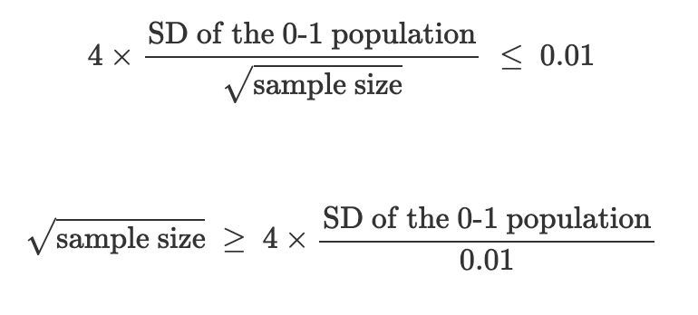
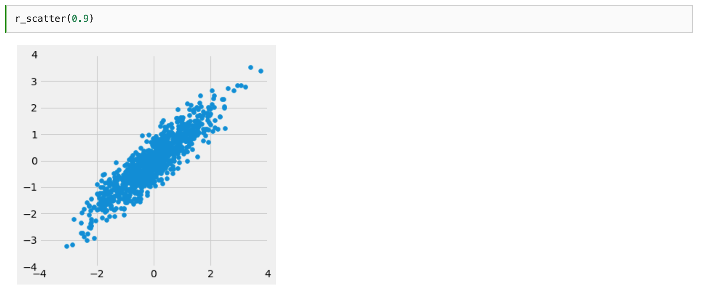
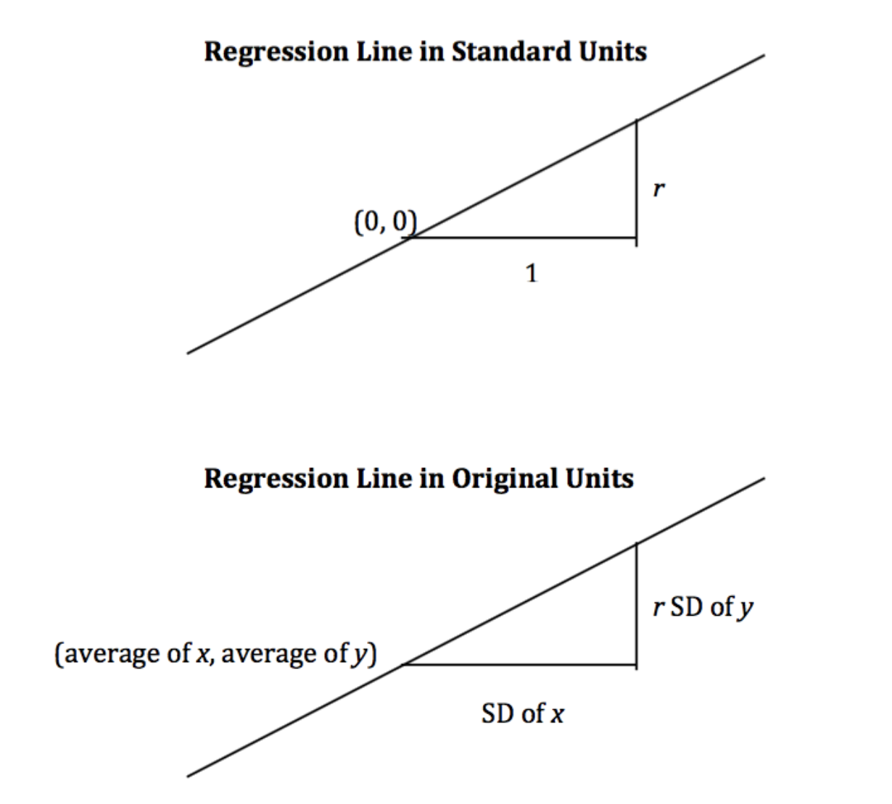

# Data 8: Foundations of Data Science

    University of California, Berkeley
    Instructors: David Wagner, Ani Adhikari
    daw@cs.berkeley.edu, adhikari@berkeley.edu
    Office Hours: 12:00 pm - 5 pm in 145 Moffitt
    http://data8.org/fa21/office-hours.html
    Lecture: Mon/Wed/Fri 10:00am-11:00am 
    https://berkeley.zoom.us/j/97862154992
    Author: Will Tholke

## Table of Contents

- [Data 8: Foundations of Data Science](#data-8-foundations-of-data-science)
  - [Table of Contents](#table-of-contents)
  - [Lecture 1, 08/25/21 (Wk1): Introduction](#lecture-1-082521-wk1-introduction)
    - [Important Dates](#important-dates)
  - [Lecture 2, 08/27/21 (Wk1): Cause and Effect](#lecture-2-082721-wk1-cause-and-effect)
    - [Chocolate & Heart Disease](#chocolate--heart-disease)
    - [Causality vs. Confounding](#causality-vs-confounding)
  - [Lecture 3, 08/30/21 (Wk2): Tables](#lecture-3-083021-wk2-tables)
    - [Integers, Names, & Functions in Python](#integers-names--functions-in-python)
    - [Tables](#tables)
      - [Table Operations](#table-operations)
  - [Lecture 4, 09/01/21 (Wk2): Data Types](#lecture-4-090121-wk2-data-types)
    - [Ints and Floats](#ints-and-floats)
    - [Text, Strings, and Conversions](#text-strings-and-conversions)
    - [Discussion Question](#discussion-question)
    - [Types](#types)
    - [Arrays](#arrays)
  - [Lecture 5, 09/03/21 (Wk2): Building Tables](#lecture-5-090321-wk2-building-tables)
    - [Arrays (Continued)](#arrays-continued)
    - [Ranges](#ranges)
    - [Ways to Create a Table](#ways-to-create-a-table)
  - [Lecture 6, 09/08/21 (Wk3): Census](#lecture-6-090821-wk3-census)
    - [Manipulating Rows](#manipulating-rows)
    - [The Decennial Census](#the-decennial-census)
    - [The Census Table](#the-census-table)
  - [Lecture 7, 09/10/21 (Wk3): Charts](#lecture-7-091021-wk3-charts)
    - [Line vs. Scatter Plot](#line-vs-scatter-plot)
    - [Good Practices of Data Visualization](#good-practices-of-data-visualization)
    - [Statistical Data Types](#statistical-data-types)
  - [Lecture 8, 09/13/21 (Wk4): Histograms](#lecture-8-091321-wk4-histograms)
    - [Distributions: Terminology](#distributions-terminology)
    - [Bar Chart](#bar-chart)
    - [The `group` Method: Introduction](#the-group-method-introduction)
    - [Distributions of Quantitative Variables](#distributions-of-quantitative-variables)
    - [Area Principle](#area-principle)
    - [Histograms](#histograms)
    - [Calculating Height](#calculating-height)
    - [Calculating Areas](#calculating-areas)
    - [Finalé: Bar Chart or Histogram?](#finalé-bar-chart-or-histogram)
  - [Lecture 9, 09/15/21 (Wk4): Functions](#lecture-9-091521-wk4-functions)
    - [Review: Area vs. Height](#review-area-vs-height)
    - [Defining Functions](#defining-functions)
    - [Apply](#apply)
  - [Lecture 10, 09/17/21 (Wk4): Groups](#lecture-10-091721-wk4-groups)
    - [Grouping](#grouping)
    - [Lists](#lists)
    - [Grouping by Multiple Columns](#grouping-by-multiple-columns)
    - [Pivot](#pivot)
    - [Group or Pivot?](#group-or-pivot)
  - [Lecture 11, 09/20/21 (Wk5): Joins](#lecture-11-092021-wk5-joins)
    - [Create a Full Table with Lists](#create-a-full-table-with-lists)
    - [What About List to Array Conversion?](#what-about-list-to-array-conversion)
  - [Lecture 12, 09/22/21 (Wk5): Table Examples](#lecture-12-092221-wk5-table-examples)
    - [Important Table Methods](#important-table-methods)
  - [Lecture 13, 09/24/21 (Wk5): Conditionals & Iteration](#lecture-13-092421-wk5-conditionals--iteration)
    - [Comparison Operators](#comparison-operators)
    - [Control Statements](#control-statements)
    - [Random](#random)
    - [A Longer Array](#a-longer-array)
    - [`for` Statements](#for-statements)
    - [Advanced `where`](#advanced-where)
  - [Lecture 14, 09/27/21 (Wk6): Chance](#lecture-14-092721-wk6-chance)
    - [Basics of Chance](#basics-of-chance)
    - [Equally Likely Outcomes](#equally-likely-outcomes)
    - [A Question](#a-question)
    - [Multiplication Rule](#multiplication-rule)
    - [Addition Rule](#addition-rule)
    - [Complement: At Least One Head](#complement-at-least-one-head)
  - [Lecture 15, 09/29/21 (Wk6): Sampling & Distributions](#lecture-15-092921-wk6-sampling--distributions)
    - [Review: Probability](#review-probability)
    - [Deterministic & Random Samples](#deterministic--random-samples)
    - [Does Sampling People Randomly Qualify as a Random Sample?](#does-sampling-people-randomly-qualify-as-a-random-sample)
    - [Probability Distribution](#probability-distribution)
    - [Empericial Distribution](#empericial-distribution)
    - [Law of Averages / Law of Large Numbers](#law-of-averages--law-of-large-numbers)
    - [Statistical Inference](#statistical-inference)
    - [Terminology](#terminology)
    - [The Catch: Probability vs. Empirical Distributions](#the-catch-probability-vs-empirical-distributions)
  - [Lecture 16, 10/01/21 (Wk6): Models](#lecture-16-100121-wk6-models)
    - [Assessing Models](#assessing-models)
    - [Approach to Assessment](#approach-to-assessment)
    - [Steps to Assessment](#steps-to-assessment)
  - [Lecture 17, 10/04/21 (Wk7): Assessing Models](#lecture-17-100421-wk7-assessing-models)
    - [Midterm Announcement](#midterm-announcement)
    - [What is a Model?](#what-is-a-model)
    - [Making Assessments](#making-assessments)
    - [Discussion Question: Data Science & Inequity](#discussion-question-data-science--inequity)
    - [Total Variation Distance](#total-variation-distance)
  - [Lecture 18, 10/06/21 (Wk7): Decisions and Uncertainty](#lecture-18-100621-wk7-decisions-and-uncertainty)
    - [Random Samples: How Extreme!](#random-samples-how-extreme)
    - [Terminology: *Hypotheses*](#terminology-hypotheses)
    - [Terminology: *Test Statistic*](#terminology-test-statistic)
    - [Connecting Hypotheses and the Statistic](#connecting-hypotheses-and-the-statistic)
    - [An Example: Coin Toss](#an-example-coin-toss)
    - [Terminology: *Inconsistency*](#terminology-inconsistency)
    - [Terminology: *p-value* (observed significance level)](#terminology-p-value-observed-significance-level)
    - [Terminology: *Error Probability*](#terminology-error-probability)
  - [Lecture 19, 10/08/21 (Wk7): A/B Testing](#lecture-19-100821-wk7-ab-testing)
    - [Introduction to A/B Testing](#introduction-to-ab-testing)
    - [Example: Smoking, Ladies, & Babies](#example-smoking-ladies--babies)
  - [Lecture 20, 10/11/21 (Wk8): Causality](#lecture-20-101121-wk8-causality)
    - [Randomized Controlled Experiment](#randomized-controlled-experiment)
    - [Example: Randomized Controlled Experiment](#example-randomized-controlled-experiment)
    - [Shortcut to Finding a Proportion](#shortcut-to-finding-a-proportion)
  - [Lecture 21, 10/13/21 (Wk8): Examples](#lecture-21-101321-wk8-examples)
    - [Three Discussion Questions to Consider](#three-discussion-questions-to-consider)
      - [Discussion Question 1](#discussion-question-1)
      - [Discussion Question 2](#discussion-question-2)
      - [Discussion Question 3](#discussion-question-3)
  - [Lecture 22, 10/03/21 (Wk8): Midterm Review](#lecture-22-100321-wk8-midterm-review)
    - [Midterm Review Lecture Slides](#midterm-review-lecture-slides)
  - [Lecture 23, 10/18/21 (Wk9): Estimation, Percentiles, & Bootstrap](#lecture-23-101821-wk9-estimation-percentiles--bootstrap)
    - [Estimation & Percentile](#estimation--percentile)
    - [Contextualizing "Percentile"](#contextualizing-percentile)
    - [The `percentile` Function](#the-percentile-function)
    - [Variability of the estimate](#variability-of-the-estimate)
    - [Where to Get Another Sample?](#where-to-get-another-sample)
    - [Bootstrapping!](#bootstrapping)
    - [Key to Resampling](#key-to-resampling)
    - [Example: Taking a Bootstrap Sample](#example-taking-a-bootstrap-sample)
  - [Lecture 24, 10/20/21 (Wk9): Interpreting Confidence](#lecture-24-102021-wk9-interpreting-confidence)
    - [Example](#example)
  - [Lecture 25, 10/22/21 (Wk9): Center and Spread](#lecture-25-102221-wk9-center-and-spread)
    - [Center (The Average/Mean)](#center-the-averagemean)
    - [Median vs. Mean](#median-vs-mean)
    - [How Far from the Average?](#how-far-from-the-average)
    - [How Big are Most of the Values?](#how-big-are-most-of-the-values)
    - [Chebyshev’s Bounds](#chebyshevs-bounds)
    - [Standard Units](#standard-units)
  - [Lecture 26, 10/25/21 (Wk10): The Normal Distribution](#lecture-26-102521-wk10-the-normal-distribution)
    - [Associated Reading](#associated-reading)
    - [The SD and the Histogram](#the-sd-and-the-histogram)
    - [Central Limit Theorem](#central-limit-theorem)
  - [Lecture 27, 10/27/21 (Wk10): Sample Means](#lecture-27-102721-wk10-sample-means)
    - [Associated Reading](#associated-reading-1)
    - [More on The Central Limit Theorem](#more-on-the-central-limit-theorem)
    - [How Accurate is the Sample Mean?](#how-accurate-is-the-sample-mean)
    - [The Square Root Law](#the-square-root-law)
  - [Lecture 28, 10/29/21 (Wk10): Designing Experiments](#lecture-28-102921-wk10-designing-experiments)
    - [Associated Reading](#associated-reading-2)
    - [The Big Question](#the-big-question)
    - [Example](#example-1)
  - [Lecture 29, 11/01/21 (Wk11): Correlation](#lecture-29-110121-wk11-correlation)
    - [Associated Reading](#associated-reading-3)
    - [Margin of Error](#margin-of-error)
    - [Associations](#associations)
    - [Convert to Standard Units](#convert-to-standard-units)
    - [The Correlation Coefficient](#the-correlation-coefficient)
    - [Calculating *r*](#calculating-r)
    - [Properties of *r*](#properties-of-r)
    - [The `correlation` function](#the-correlation-function)
    - [Final words on correlation](#final-words-on-correlation)
  - [Lecture 30, 11/03/21 (Wk11): Linear Regression (and it's my 21st birthday!)](#lecture-30-110321-wk11-linear-regression-and-its-my-21st-birthday)
    - [Associated Reading](#associated-reading-4)
    - [Why is *r* helpful?](#why-is-r-helpful)
    - [Measuring in Standard Units](#measuring-in-standard-units)
    - [Interpretations of a Graph](#interpretations-of-a-graph)
    - [The Regression Line](#the-regression-line)
    - [The Regression Effect](#the-regression-effect)
    - [The Equation of the Regression Line](#the-equation-of-the-regression-line)
    - [Fitted Values](#fitted-values)
  - [Lecture 31, 11/05/21 (Wk11): Least Squares](#lecture-31-110521-wk11-least-squares)
    - [What's a Line even for?](#whats-a-line-even-for)
    - [Root Mean Squared Error](#root-mean-squared-error)
    - [What's So Special About the Regression Line?](#whats-so-special-about-the-regression-line)
    - [Nonlinear Regression](#nonlinear-regression)
  - [Lecture 32, 11/08/21 (Wk12): Residuals](#lecture-32-110821-wk12-residuals)
    - [Associated Reading](#associated-reading-5)
    - [Residuals](#residuals)
    - [The `residual` Function](#the-residual-function)
    - [Regression Diagnostics](#regression-diagnostics)
    - [Detecting Nonlinearity](#detecting-nonlinearity)
    - [Detecting Heteroscedasticity](#detecting-heteroscedasticity)
    - [Trends of Residuals](#trends-of-residuals)
    - [Average of Residuals](#average-of-residuals)
    - [SD of the Residuals](#sd-of-the-residuals)
    - [Another Way to Interpret *r*](#another-way-to-interpret-r)
  - [Lecture 33, 11/10/21 (Wk12): Regression Inference](#lecture-33-111021-wk12-regression-inference)
    - [Associated Reading](#associated-reading-6)
    - [Inference for the True Slope](#inference-for-the-true-slope)
    - [Bootstrapped Scatter Plot](#bootstrapped-scatter-plot)
    - [Prediction Intervals](#prediction-intervals)
    - [Variability of the Prediction](#variability-of-the-prediction)
    - [Bootstrap Prediction Interval](#bootstrap-prediction-interval)
    - [Assumptions](#assumptions)
  - [Lecture 34, 11/12/21 (Wk12): Privacy](#lecture-34-111221-wk12-privacy)
  - [Lecture 35, 11/15/21 (Wk13): Classification](#lecture-35-111521-wk13-classification)
    - [Associated Reading](#associated-reading-7)
    - [Context](#context)
    - [k-Nearest Neighbors Classification](#k-nearest-neighbors-classification)
    - [Distance Between Points w/ Two Attributes](#distance-between-points-w-two-attributes)
    - [k-Nearest Neighbor Steps](#k-nearest-neighbor-steps)
  - [Notes: Project 3 – Movie Classification Checkpoint](#notes-project-3--movie-classification-checkpoint)
    - [Part 1: The Dataset](#part-1-the-dataset)
      - [Question 1.0](#question-10)
      - [Question 1.1.1](#question-111)
      - [Question 1.1.2](#question-112)
      - [Question 1.1.3](#question-113)
      - [Question 1.1.4](#question-114)
      - [Question 1.2.1](#question-121)
      - [Question 1.2.2](#question-122)
      - [Question 1.3.1](#question-131)
      - [Question 2.1.1](#question-211)
      - [Question 2.1.2](#question-212)
      - [Question 2.1.3](#question-213)
      - [Question 2.1.4](#question-214)
    - [Question 2.1.5](#question-215)
  - [Lecture 36, 11/17/21 (Wk13): Classifiers I](#lecture-36-111721-wk13-classifiers-i)
    - [Associated Reading](#associated-reading-8)
    - [Subtitle #1](#subtitle-1)
  - [Lecture 37, 11/19/21 (Wk13): Classifiers II](#lecture-37-111921-wk13-classifiers-ii)
    - [Associated Reading](#associated-reading-9)
    - [Subtitle #1](#subtitle-1-1)
  - [Lecture 38, 11/22/21 (Wk14): Decisions](#lecture-38-112221-wk14-decisions)
    - [Associated Reading](#associated-reading-10)
    - [Subtitle #1](#subtitle-1-2)
  - [Lecture 39, 11/29/21 (Wk15): TBA](#lecture-39-112921-wk15-tba)
    - [Subtitle #1](#subtitle-1-3)
  - [Lecture 40, 12/03/21 (Wk15): Conclusion](#lecture-40-120321-wk15-conclusion)
    - [Subtitle #1](#subtitle-1-4)


## Lecture 1, 08/25/21 (Wk1): Introduction

### Important Dates

- **Midterm:** Friday October 15, 7-9pm PT
- **Final:** Monday, December 13, 8-11am PT
- **Labs:** due Wednesdays, 9am
- **Homework:** due Thursdays, 12am

## Lecture 2, 08/27/21 (Wk1): Cause and Effect

### Chocolate & Heart Disease

**Question:** Is there any relation between chocolate consumption and heart disease?
- Individuals, study subjects, participants, units: 336,289 US, Swedish, & Australian adults in various studies
- Treatment: chocolate consumption
- Outcome: heart disease

**Answer:** Yes, because those who ate chocolate had less heart disease

### Causality vs. Confounding

If the **treatment** and **control** groups are similar apart from the treatment, then differences between the outcomes in the two groups can be ascribed to the treatment (causality).

However, if the **treatment** and **control** groups have systematic differences other than the treatment, then it might be difficult to identify causality (due to counfounding variables).

Therefore, **randomized controlled experiments** are considered to be the industry standard.

## Lecture 3, 08/30/21 (Wk2): Tables

Check out the [Data8 Python Reference](http://data8.org/sp19/python-reference.html) for more comprehensive documentation

### Integers, Names, & Functions in Python

```py
# Integers
>>> 2 ** 4  # 2^4
16
>>> 2 + 8
10
>>> 5.0 + 2 * 9  # 5.0 + (2 * 9)
23.0

# Names
>>> a = 1
>>> b = 2
>>> total = a + b
>>> total
3

# Functions & Call Expressions
>>> abs(-5)
5
>>> round(123.456)
123
>>> round(123.456, ndigits=2)
123.46
```

### Tables

- A `Table` is a sequence of labeled columns
- Each **row** represents one individual
- Data within a **column** represents one attribute of the individuals

#### Table Operations

- `t.select(label)` - constructs a new table with just the specified columns
- `t.drop(label)` - constructs a new table in which the specified columns are omitted
- `t.sort(label)` - constructs a new table with rows sorted by the specified column
- `t.where(label, condition)` - constructs a new table with the rows that meet the condition


## Lecture 4, 09/01/21 (Wk2): Data Types

### Ints and Floats

**Python has two real number types:**

- **int:** integer of any size
  - never has a decimal point, e.g. `2` or `3`
- **float:** a number with an optional fraction part
  - always has a decimal point, e.g. `2.0` or `3.14`
  - s**ome limitations:** limited precision of 15-16 decimal places, arithmetic may result in the final few decimal places being wrong, have limited size

### Text, Strings, and Conversions

A string value is a snippet of text of any length

- `'a'`, `'word'`, `"there can be 2 sentences. Here's the second!"`
- Type conversions: `int('12')` becomes `12`, `float('1.2')` becomes `1.2`, or `str(5)` becomes `"5"`
  - `int(1.2)` becomes `1.0`, effectively **losing** information! Beware of this!

### Discussion Question

**Assume you have run the following statements:**

```py
>>> x = 3
>>> y = '4'
>>> z = '5.6'
```

What is the source of error in each example?

- **A.** `x + y`
  - You cannot add an int with a string
- **B.** `x + int(y + z)`
  - `int(y + z)` will throw an error; y + z is '45.6', but int('45.6') will not work
- **C.** `str(x) + int(y)`
  - You cannot add a string with an int
- **D.** `y + float(z)`
  - You cannot add a string with a float

### Types

We've seen the following types so far:

- **int:** `2`
- **float:** `2.2`
- **str:** `'Hello there!'`
- **builtin_function_or_method:** `abs()`
- **Table**

The `type()` function can tell you the type of a value

### Arrays

**An array contains a sequence of values:**

- All elements of an array should have the **same type**
- Arithmetic is applied to each individual element
- Adding arrays together adds elements (if same length!)
- A column of a table is an array

## Lecture 5, 09/03/21 (Wk2): Building Tables

### Arrays (Continued)

```py
>>> my_array = make_array(1, 2, 3, 4)  # assign array object to my_array
>>> my_array
array([1, 2, 3, 4])
>>> len(my_array)  # returns the num items in an array
4
>>> sum(my_array)
10
>>> np.average(my_array)
2.5
>>> array_2 = make_array(70, 60, 90, 80)
>>> array_2
array([70, 60, 90, 80])
>>> my_array + array_2  # arrays msut be the same length to add
array([71, 62, 93, 84])
>>> array_3 = make_array(5, 6, 7)
>>> array_3 + array _2
ValueError: operands could not be broadcast together with shapes (4,) (3,)
>>> array_3.item(0)
5
```

### Ranges

A range is an array of consecutive numbers:

- The range always includes start but excludes end
- `np.arange(end)`: an array of increasing integers from 0 up to end
- `np.arange(start, end)`: an array of increasing integers from start up to end
- `np.arange(start, end, step)`: a range with `step` between consecutive values

### Ways to Create a Table

- `Table.read_table(filename)` reads a table from .csv
- `Table()` creates an empty table
- `select, where, sort` etc. is also useful

```py
>>> streets = make_array('Bancroft', 'Durant', 'Channing', 'Haste')
>>> streets
array(['Bancroft', 'Durant', 'Channing', 'Haste'], dtype='<U8')
>>> Table()
# no output
>>> southside = Table().with_column('Streets', streets)
>>> southside
  ________
| streets  |
  ________
| Bancroft |
  ________
| Durant   |
  ________
| Channing |
  ________
| Haste    |
  ________
```

## Lecture 6, 09/08/21 (Wk3): Census

### Manipulating Rows
  
- `t.sort(column)`: sorts the rows in increasing order
- `t.sort(column, descending=True)`: sorts the rows in decreasing order
- `t.take(row_numbers)`: keeps the numbered rows
- `t.where(column, are.conditions)`: keeps the rows for which a column's value satisfies a condition
- `t.where(column, are.equal_to(value))` keeps rows for whcih a column's value equals a particular value

### The Decennial Census

- Every ten years, the Census Bureau counts how many people there are in the United States
- In between censues, the Bureau makes an estimate about how many people there are each year
  
### The Census Table

- Values have column-dependent interpretations
  - The `SEX` column: 1 is `Male`, 2 is `Female`
  - The `POPESTIMATE2010` column: 7/1/2010 estimate
- Some rows are the sum of other rows
  - The `SEX` column: 0 is total of `Male` and `Female` categories
  - The `AGE` column: 999 is the total of all ages
- Numeric codes are used for storage efficiency


## Lecture 7, 09/10/21 (Wk3): Charts

### Line vs. Scatter Plot

- `t.plot(x_label, y_label)`
  - Use for sequential quantitative data iff 
    - x-axis has order
    - sequential differences in y are meaningful
    - 1:1 ratio of y-value to x-value
    - **oftentimes,** x-axis is *time* and y-axis is *distance*
- `t.scatter(x_label, y_label)`
  - Use for non-sequential quantitative data

### Good Practices of Data Visualization
  
- **Less can be more!**
  - Minimize decoration
  - Minimize colors
- **Represent numerical data correctly**; i.e. preserve their relative values and distances between one another

### Statistical Data Types

- **Quantitative:** measured numerically (age, population size)
- **Categorical:** 
  - Unordered (color of shoes)
  - Ordered ("not satisfied, satisfied, very satisfied")

- **"Numerical"** *(but actually categorical)* **variables**:
  - 1 for "Berkeley student", 0 for "not a Berkeley student
  - Doing arithmetic with the numbers is arbitrary and useless
  - Distances between numerical values have no clear meaning

## Lecture 8, 09/13/21 (Wk4): Histograms

### Distributions: Terminology

- **Individuals:** those whose features are recorded
- **Variable:** a feature, an attribute
  - can be *quantitative* or *categorical* (and of many sub-types within these)
  - has different values
  - each *individual* has exactly *one value*
  - has a *distribution:*
    - for each different value of the variable, the frequency of individuals that have that value

In a distribution, each individual is ine exactly one category. The sum of the percent of individuals in each category adds up to 100%.

### Bar Chart

- **Utility:** display all the values of the variables along with their frequencies; the attributes are as folows:
  - one bar for each category
  - you can choose the order of the bars
  - length of the bar is the percent (or count) of individuals in that category
  
### The `group` Method: Introduction

- The `group` method counts the number of rows for each value in the column

**Example:**

```py
studios = top_movies.select('Studio')
studios.group('Studio').show(3)
```

### Distributions of Quantitative Variables

- Binning is counting the number of numerical values that lie within ranges, called *bins*:
  - Bins are defined by their lower bounds (inclusive)
  - The upper bound (exclusive) is the lower bound of the next bin

### Area Principle

**Areas** should be proportional to the values they represent;
- 20% of a population can be represented by (x)
- 40% of a population cab be represented by (x)(x), but not by a large (X)

### Histograms

- **Utility:** display the distribution of a quantitative variable
  - One bar corresponds to each bin
  - Uses the area principle
    - The *area* of each bar is the *percent* of individuals in the corresponding bin

- You can create a histogram by using `hist`, which uses a scale `(normed=True)` that ensures the area of the chart sums to 100%
- The *area* of each bar is a percentage of the whole
  - The whole sums to 100%
- The horizontal axis is a number line (e.g. years) and the bins sizes don't have to be equal to each other
- The gvertical axis is a rate (e.g., percent per year)
  
### Calculating Height

The [40, 60) bin contains 46 out of 200 movies
- "46 out of 200" is 23% of the whole
- The bin is 60 - 40 = 20 years wide

```
Height of bar = 23 percent / 20 years 
              = 1.15 percent per year
```

```
Height of bar = % of the whole in bin / width of bin
              = ## percent per unit of width
```

- The height measures the percent of data in the bin *relative to the amount of space in the bin.*
- Height measures **density** (crowdedness)
- Units: percept per unit on the horizontal axis

### Calculating Areas

```
Area of bar = % in bin 
            = height x width of bin
```

**Question:** how many individuals are in the bin?

- **Answer:** use area

**Question:** how crowded is the bin?

- **Answer:** use height

### Finalé: Bar Chart or Histogram?

**Use a bar chart when:**

- Distribution of categorical variable
- Bars have arbitrary (but equal) widths and spacings; in any order
- height (or length) and area of bars proportional to the percent of individuals
  
**Use a histogram when:**

- Distribution of quantitative variable
- Horizontal axis is numerical; drawn to scale, no gaps, bins can be unequal
- Area of bars proportional to the percent of individuals; height measures density

## Lecture 9, 09/15/21 (Wk4): Functions

### Review: Area vs. Height
  
```
Area of Bar = Percent in Bin
            = Height x Bin Width
```

How many individuals... use *area*; how crowded(dense)... use *height*

### Defining Functions

The following block of code is a function in Python

```py
def spread(values):
  return max(values) - min(values)
```

The `spread()` function contains the following:

- **Name:** `spread`
- **Argument names (parameters):** `values`
- **Body:** `return max(values) - min(values)`
- **Return expression:** ` max(values) - min(values)`

### Apply

What does apply do?

- It calls a function on every element in the input column(s)
- Returns an array that contains the function applied to every element
  - `table_name.apply(funciton_name, 'column_label(s)')`
- `function_name` refers to the function that is to be applied to the specified input columns `column_label(s)`


## Lecture 10, 09/17/21 (Wk4): Groups

### Grouping

The `group` method aggregates all rows with the same value for a column into a single row in the resulting table

- First argument: which column to group by
- Second argument: (Optional) how to combine values
  - len – number of grouped values (default)
  - list – list of all grouped values
  - sum – total of all grouped values

### Lists

A list is a sequence of values (just like an array), but the values can have different types:

- Lists can be used to create table rows
- If you create a table column from a list, it will be converted to an array automatiaclly

### Grouping by Multiple Columns

The `group` method can also aggregate all rows that share the combination of values in multiple columns
- **First argument:** a list of which columns to group by
- `collect=...`: (Optional) how to combine values

### Pivot

- Cross-classifies according to two categorial variables
- Produces a grid of counts or aggregated values
- Two required arguments:
  - First: variable that forms column labels of grid
  - Second: variable that forms row labels of grid
- Two optional arguments (include both or neither):
  - `values='column_label_to_aggregate`
  - `collect=function_to_aggregate_with`

```py
# Out of context example
sky.pivot('city', 'material', values='height', collect=max)
```

### Group or Pivot?

- Distribution of one categorical variable -> `.group()`
- Cross classification of two or more categorical variables:
  - One row per combination -> `.group()`
  - One variable vertically, one horizontally -> `.pivot()`


## Lecture 11, 09/20/21 (Wk5): Joins

### Create a Full Table with Lists

```py
>>> drinks = Table(['Drink', 'Cafe', 'Price])
>>> drinks # this will show the table on the next line
Drink | Cafe | Price |
----------------------
```

```py
>>> drinks = drinks.with_rows([["Milk Tea", "Feng Cha", 5.5], ...]]) # nested list
>>> drinks
Drink    |   Cafe   | Price |
-----------------------------
Milk Tea | Feng Cha |  5.5  |
...
```

### What About List to Array Conversion?

You can only convert a list to an array when all of the elements in the list are of the same type!

- **Valid:** `[1, 2, 3, 4, 5]`
- **Invalid:** `[1, 2, 3, 4, "dog"]` (all integers will be converted to strings; you don't want this)


## Lecture 12, 09/22/21 (Wk5): Table Examples

### Important Table Methods
  
```py
>>> t.select(column, …) or t.drop(column, …)
>>> t.take([row_num, …]) or t.exclude([row_num, …])
>>> t.sort(column, descending=False)
>>> t.where(column, are.condition(...)) 
>>> t.apply(function_name, column, …)
>>> t.group(column) or t.group(column, function_name)
>>> t.group([column, …]) or t.group([column, …], function_name)
>>> t.pivot(cols, rows) or t.pivot(cols, rows, vals, function_name)
>>> t.join(column, other_table, other_table_column)
```

## Lecture 13, 09/24/21 (Wk5): Conditionals & Iteration

### Comparison Operators

Note that the result of a comparison expression is a `bool` value, named after [George Boole](https://en.wikipedia.org/wiki/George_Boole)


```py
# Assignment Statement
>>> x = 2
>>> y = 3

# Comparison Expression
>>> x > 1
True
>>> x > 100
False
>>> x == y
False
>>> 2 < x < 5
False
>>> 1 + 1 + 0 == 2
True
```

### Control Statements

These statements *control* the sequence of computations that are performed in a program

- The keywords `if` and `for` begin control statemnets
- The purpose of an `if` statement is to define functions that choose different behavior based on their arguments
  

### Random

`np.random.choice`:

- Selects uniformly at random
- with replacement
- from an array
- a specified number of times
  - e.x.: `np.random.choice(some_array, sample_size)`

### A Longer Array

`np.append(array_1, value)`

- new array with `value` appended to `array_1`
- `value` has to be of the same type of elements as `array_1`

### `for` Statements

- `for` is a keyword that beings a control statement
  - You can think about `for` as "for item in iterable"
- `for` performs a computation for every element in a list or array
  
```py
for item in some_array:
  print(item)
```

### Advanced `where`

`t.where(array_of_bool_values)`

- returns a table with only the rows of t for which the corresponding `bool` is True

## Lecture 14, 09/27/21 (Wk6): Chance

### Basics of Chance

- **Lowest value:** 0
  - Chance of event that is impossible
- **Highest value:** 1 (or 100%)
  - Chance of event that is certain
- **Complement:** if an event has a chance of 70%, then the chance that it doesn't happen is 30% (0.3)
  
### Equally Likely Outcomes

Assuming that all outcomes are equally likely, the chance of an event A is:

```
P(A) = number of outcomes that make A happen / total number of outcomes
```

### A Question

Three cards: *ace of hearts*, *king of diamonds*, *queen of spades*
- Shuffle them and draw two cards at random
  
What's the chance that I get the *queen of spades* followed by the *king of diamonds*?

### Multiplication Rule

Chance that two events *A* and *B* both happen:

```
= P(A happens) x P(B happens given that A has happened)
```

- The answer is less than or equal to each of the two chances being multiplied
- The more conditions you have to satisfy, the less likely you are to satisfy them all 

### Addition Rule

If event *A* can happen in *exactly one* of two ways, then

```
P(A) = P(first way) + P(second way)
```

- The answer is greater than or equal to the chance of each individual way

### Complement: At Least One Head

**- In 3 tosses:**
  - Any outcome *except* TTT
  - P(TTT) = (1/2) x (1/2) x (1/2) = 1/8
  - P(at least one head) = 1 - P(TTT) = 1 - (1/8) = 87.5%
**- In 10 tosses:**
  - 1 - (1/2)**10 = 99.9%

## Lecture 15, 09/29/21 (Wk6): Sampling & Distributions

### Review: Probability
  
A population has 100 people, including `Rick` and `Morty`; we sample two people at random without replacement.

What's the probability that `Rick` and `Morty` are both in the sample (`P(both Rick and Morty in sample`)? 

- P(first Rick, then Morty) + P(first Morty, then Rick)
  - `(1/100) * (1/99) + (1/100) * (1/99) = 0.0002`

What's the probability that neither `Rick` nor `Morty` are in the sample (`P(neither Rick nor Morty in sample`)? 

- `(98/100) * (97/99) = 0.9602`

Confused? Check out the [multiplication](#multiplication-rule) & [addition](#addition-rule) rules.

### Deterministic & Random Samples

- **Deterministic sample:** when the sampling scheme doesn't involve chance
- **Random sample:** before drawing a sample, it's required that we know the selection probability of every group of people in the population; however, not all individuals/groups *have* to have an equal chance of being selected

### Does Sampling People Randomly Qualify as a Random Sample?

Let's say that a sample consists of whoever walks by. Are we taking a [random sample](#random-samples)?

Well, not quite! We need to know the **population** and **chance of selection** for each group in that population or else the sample isn't random.

### Probability Distribution

- Random quantity with various possible values
- **"Probability distribution:"**
  - All the possible values of the *quantity*
  - The *probability* of each of those values
- If you can do the math, you can work out the probability distribution without ever simulating it... but simulation is often easier

### Empericial Distribution

- The word **empirical** is used in many different contexts, and means "based on observations"
- Empirical oservations can be from repetitions of an experiment
- **"Empirical Distribution"**
  - All observed values
  - The proportion of times each value appears

Note that, if the sample size is large, the **empirical distribution** of a **uniform random sample** resembles the distribution of the population with *high probability*

### Law of Averages / Law of Large Numbers

**Quoted directly from the lecture slides:**
- "If a chance experiment is repeated many times, independently and under the same conditions, then the proportion of times that an event occurs gets closer to the theoretical probability of the event"
  - **Example:** "As you increase the number of rolls of a die, the proportion of times you see the face with five spots gets closer to 1/6"
  - **My (slightly cooler) example:** As you increase the number of hours you study in one library–either Moffitt, Doe, or Main Stacks– the proportion of times you study at Main Stacks gets closer to 1/3
  - **The simplest example in existence:** flip a coin an infinite number of times and you'll have gotten heads 50% of the time and tails 50% of the time.

### Statistical Inference

**Statistical inferences** are conclusions which are made based on data in random samples

  - **Example:** use the data to guess the number of an unknown (fixed) number
  - Create an **estimate**, which depends on the random sample, of the unknown quantity

### Terminology

- **Parameter:** a number associated with the population
- **Statistic:** a number calculated from the sample
  - A **statistic** can be used as an estimate of a **parameter** == a number calculated from the sample can be used as an estimate of a number associated with the population

### The Catch: Probability vs. Empirical Distributions

- **Probability distributions** are...
  - varying, since random samples vary
  - including all posisble values of the statistic and all the corresponding probabilities
  - sometimes hard to calculate! You'll either have to do the math or generate all possible samples and calculate the statistic based on each sample
- **Empirical distributions** are...
  - based on simulated values of the statistic
  - consist of all the observed values of the statistic and the proportion of times each value appeared
  - is a good approximation to the probability distribution of the statistic (iff the number of repetitions in the simulation is *fairly large*)

## Lecture 16, 10/01/21 (Wk6): Models

### Assessing Models
  
- A **model** is a set of assumptions about the data
- In data science, many models involve assumptions about processes that involve randomness, such as **chance models**

The key question we want to ask is, *does the model fit thed data?*

### Approach to Assessment

- If we're able to simulate data according to the assumptions of the model, we can learn what the model predicts
- Then, we can compare the predictions to the data that were observed
- If *both* the data and the model's predictions are not consistent, that is evidence *against* the model!

### Steps to Assessment

- *Choose a statistic* to measure discrepancy between model and data
- *Simulate the statistics* under the model's assumptions
- *Compare* the data to the model's predictions
  - Draw a histogram of simulated values of the statistic
  - Compute the observed statistic from the real sample
- If the observed statistic is far from the histogram, that is evidence against the model

## Lecture 17, 10/04/21 (Wk7): Assessing Models

### Midterm Announcement

The midterm is 7pm-8:30pm on Friday, 10/15 and contains content through Chapter 12.

### What is a Model?
  
- A model is a set of asusmptions about the data–it's our attempt to explain the origins of the data
- In data science, many models involve assumptions about processes that involve randomness, such as **chance models**

### Making Assessments

- If we can simulate data according to the assumptions of the model,we can learn what the model predicts
- We can then compare the predictions to the data that were observed
- If the data and the model's predictions are not consistent, that is evidence against the model

### Discussion Question: Data Science & Inequity

**Robert Swain v. Alamaba**

- **Court's view:** 8/100 black jurors is less than 26%, but not different enough to show that Black panelists were systematically excluded
- **Question:** Would 8/100 be a realistic outcome if the jury panel selection process were truly unbiased?
  - **My answer:** looking at the data, definitely not.

### Total Variation Distance

**Every distance has a computational recipe:** *Total Variation Distance (TVD)*
- For each category, compute the difference in proportions between two distributions
- Add up the absolute values of each difference
- Divide the sum by 2

**So, what does TVD *do*?**
- We can use it as the statistic to assess whether a sample was drawn randomly from a known categorial distribution
- Sample at random from the population and compute the TVD from the random sample; repeat numerous times
- *We should compare...*
  - Empirical distribution of simulated TVDs
  - Actual TVD from the sample in the study

## Lecture 18, 10/06/21 (Wk7): Decisions and Uncertainty

### Random Samples: How Extreme!

- Random samples can turn out quite exxtreme–unlikely, but possible
- For random samples, we can measure this chance

### Terminology: *Hypotheses*

- A test chooses between two views of how data were generated
- The views are called **hypotheses**
- The test helps us choose between the two views, based on consistency with the data

**Gregor Mendel's Model:**

- Mendel took pea plants of a particular kind, each with either purple flowers or white flowers
- He claimed that
  1. Each plant is purple-flowering with a chance of 75% and
  2. this was regardless of the colors of the other plants

The **Null Hypothesis** is that Mendel had...
- A well defined chance model ahout how the data were generated
- A model under which we can simulate data under its assumptions, "under the null hypothesis"
- A good model: the plants are like draws at random with replacement from the distribution [0.75, 0.25]

The **Alternative hypothesis:** is that Mendel had...
- A poorly defined model (this hypothesis is a different view about the origin of the data)

### Terminology: *Test Statistic*

The **test statistic** is the statistic that we choose to simulate in order to decide between the two hypotheses

Before choosing the statistic, we should consider two questions:

1. What values of the statistic will make us lean towards the null hypothesis?
2. What values will make us lean towards the alternative?

**Choosing a Statistic:**

- Start with the percentage of purple flowering-plants in sample
- If that percent is much larger or much smaller than 75, that is evidence against the model
- The **distance** from 75 is the key

- Statistic = | sample percent of purple-flowering plants - 75 |
- If the statistic is large, that is evidence against the model

### Connecting Hypotheses and the Statistic

**Predicting the Statistic Under the Null:**

- Simulate the test statistic under the null hypothesis; draw the histogram of the simulated values
  - This displays the *empirical distribution of the statistic under the null hypothesis*

- The prediction about the statistic made by the null hypothesis
  - Shows all the likely values of the statistic
  - How likely they are *(iff the null hypothesis is true)*

Note that the probabilities are approximate because we can't generate *all* the possible random samples

**Conclusion of the Test Based on Tail Area:**

- Start at the observed value of the test statistic
- Look in the direction that favors the alternative hypothesis
  - If that tail is small, the data are not consistent with the null
  - If not, the data are consistent with the null

In Mendel's model, large values of the distance favor the alternative

### An Example: Coin Toss

- **Null:** The coin is fair
- **Alternative:** The coin is biased towards tails
- **Statistic:** Number of heads
  
Small values of the number of heads (and thus large values for the number of tails) favorites the alternative, that the coin is biased towards tails

### Terminology: *Inconsistency*

- **"Inconsistent"** means that the test statistic is in the tail of the empirical distribution under the null hypothesis
- **"In the tail," first convention:**
  - The area in the tail is less than 5%
  - The result is "statistically significant"

- **"In the tail," second convention:**
  - The area in the tail is less than 1%
  - The result is "highly statistically significant"

### Terminology: *p-value* (observed significance level)

- The **p-value** (observed significance level) is the chance, under the null hypothesis, that the test statistic is equal to the value that was observed in the data or is even futther in the direction of the alternative

### Terminology: *Error Probability*

The cutoff for the p-value is an **error probability**.

If your cutoff is 5% and the null hypothesis happens to be true, then there is about a 5% chance that your test will reject the null hypothesis

So, why 5%? It's because of Sir Ronald Fisher (1890-1962)!

"It is convenient to take this point [5%] as a limit in judging whether a deviation is to be considered significant or not."
– Statistical Methods for Research Workers, 1925

## Lecture 19, 10/08/21 (Wk7): A/B Testing

### Introduction to A/B Testing
  
- Compare values of sampled individuals in *Group A* with values of sampled individuals in *Group B*

In order to answer the question, "Do the two sets of values come from the same underlying distribution?", we have to perform a statistical test called **A/B Testing**

- A/B testing might also be referred to as permutation testing
  
### Example: Smoking, Ladies, & Babies

- Random samples of mothers of newborns. Compare:
  - **(A)** Birth weights of babies of mothers who smoked during pregnancy
  - **(B)** Birth weights of babies of mothers who didn't smoke

**Question:** could the difference be due to chance alone?

What's one easy way to remember what **A/B Testing** is?

**Null Hypothesis:** in the population, the distributions of the birth weights of the babies in the two groups are the same (They are different in the smaple just due to cahance alone)

**Alternative:** in the population, the babies of the mothers who didn't smoke were heavier, on average, than the babies of the smokers

**Test Statistic:** Difference between average weights, where Group A = smokers, Group B = non-smokers
- `Group B average - Group A Average`
- `Weight of non-smokers - weight of smokers`

Now, let's simulate under the null hypothesis!

If the null is true, all rearrangements of the birth weights among the two groups are equally likely

**Plan:**
- Shuffle all the birth weights
- Assign some to "Group A" and the rest to "Group B", maintaining the two sample sizes
- Find the difference between the averages of the two shuffled groups

[Click here to see the demo!](https://data8.datahub.berkeley.edu/hub/spawn-pending/willtholke?next=%2Fuser%2Fwilltholke%2Fgit-sync%3Frepo%3Dhttps%253A%252F%252Fgithub.com%252Fdata-8%252Fmaterials-fa21%26subPath%3Dlec%252Flec19.ipynb)


## Lecture 20, 10/11/21 (Wk8): Causality

### Randomized Controlled Experiment
  
- **Sample A:** control group
- **Sample B:** treatment group

If the treatment and control groups are selected at random, then *you can make causal conclusions*.

Any difference in outcomes between the two groups could be due either to *chance* or *the treatment*

### Example: Randomized Controlled Experiment

- In the population, there is one imaginary ticket for each of the 31 participants in the experiment.
- Each participant's ticket has...
  - "Outcome if assigned to treatment group" (Potential outcome)
  - "Outcome if assigned to control group" (Potential outcome)

**The Hypothesis:**

- **Null:** The distribution of all 31 potential control scores is the same as the distribution of all 31 potential treatment stores
- **Alternative:** More (or fewer) of the potential treatment scores are 1 (pain improves) than the potential control scores.

### Shortcut to Finding a Proportion

```
>>> tbl.pivot('Result', 'Group')
>>> tbl.group('Group', np.average)
```

## Lecture 21, 10/13/21 (Wk8): Examples

### Three Discussion Questions to Consider

#### Discussion Question 1

- A class has 12 sections
- After exam scores are released, one section complains that its scores are too low
- The GSI says, "It could just be chance!"

Is the GSI correct? How do we decide?

#### Discussion Question 2

- The distributors of Great Cakes run a taste test
- 40 out of 100 tasters prefer Great Cakes over it's rival, Better Cakes

**Question:** Do fewer people prefer Great Cakes than its rival, or is this just chance?
**Null Hypothesis:** The results are like tossing a fair coin
**Alternative Hypothesis:** The chance of liking Super Soda is less than 0.5
**Test statistic:** Number of tasters who liked Great Cakes
**p-value:** Start at the observed statistic and look which way?

#### Discussion Question 3

- A roulette wheel has 38 pockets: 18 red, 18 black, and 2 green
- The wheel is spun 380 times: 166 red, 186 black, and 28 green
  
**Question:** Is the wheel fair or not?

Try and construct a *null hypothesis*, *alternative hypothesis*, *test statistic*, and think about the *p-value*

## Lecture 22, 10/03/21 (Wk8): Midterm Review

### Midterm Review Lecture Slides
  
Check out the slides [here](https://docs.google.com/presentation/d/1N52a9TKZJFEBKQlMNNQRexZGKl91DOb5Hf4i5Se79TY/edit).

## Lecture 23, 10/18/21 (Wk9): Estimation, Percentiles, & Bootstrap

### Estimation & Percentile

- A **parameter** is a number that is calculated based on the proportion
- To figure out the value of a parameter, we need data; if we have the relevant data for the entire population, we can calculate the parameter
- On the topic of *rank:*
  - Values of a numerical data set have a *rank order*
  - A **percentile** is the value at a particular rank

### Contextualizing "Percentile"

Intuitively, we know that **percentile** relates to the percentage of some data. In stricter terms, we know that any `ith` percentile is the smallest value in a sample of the population that is at least as large as `i` percent of the sample. The `ith` percentile has `i` percent of values less than or equal to it; `i` is the smallest value in the data for which this statement is true.

### The `percentile` Function
  
- The `pth` percentile of a set of numbers is the smallest value in the set that is **at least as large as `p%`** of the elements in the set
- Function in the `datascience` module:
  - Takes in a rank between 0 and 100 and an array
  - `percentile(p, values_array)`
  - Evaluates to the pth percentile of the array
- The percentile function cannot return any integer with decimals unless there is an integer with decimals in the list; it can only return numbers in the list
- The 80th percentile of a list `[1, 7, 3, 9, 5]` is ordered element 4: `(80/100) * 5`

**Out of Context Example**:

```py
# Median total compensation in a population
pop_median = percentile(50, sf.column("Total Compensation))
pop_median
135747.0
```

For more on using the percentile function, check out [Chapter 13.1.Percentiles](https://inferentialthinking.com/chapters/13/1/Percentiles.html).

### Variability of the estimate

- One sample -> one estimate...
- But the random sample could have come out differently
- Therefore, the estimate could have been different

### Where to Get Another Sample?

- We want to understand variability of our estimate
- Given the **population**, we could simulate
  - ...but we only have the **sample**!

### Bootstrapping!

- A technique for generating new samples from old samples
- We have the original sample, and it probably resembles the population
- So let's draw from our sample instead of the population again

In summary, we gtreat the original sample as a **stand-in** for the population! The process is as follows:

- We have: 
  - population, our sample
- Process:
  1) Take sample from population 
  2) Sample from (1)
  3) Repeat (2) as many times as needed!

Resampling from the original sample is like sampling from the population with *high probability*. It doesn't always hold, but it's reasonable to assume that we can use it if the original sample is alrge enough

### Key to Resampling

- From the original sample,
  - draw at random
  - *with replacement*
  - and as many values as the original sample contained

- The size of the new sample has to be the same as the original one so that the two estimates are comparable

### Example: Taking a Bootstrap Sample

```
# Take a bootstrap sample
bootstrap_sample = out_sample.sample()

# Boostrap Sample Median
percentile(50, bootstrap_sample.column('Column Name'))
```

## Lecture 24, 10/20/21 (Wk9): Interpreting Confidence

### Example

**Question:** What is the average age of mothers in the population?

**Answer:**
- Bootstrap the births sample
- Find the mean
- Repeat this process
- Graph all the means (from an array of means)
- 95% confidence interval: 23.5th for 97.5th percentiles of the array

## Lecture 25, 10/22/21 (Wk9): Center and Spread

### Center (The Average/Mean)
  
The **average/mean** is a measure of center.

**Data:** 2, 3, 3, 9
**Average** = (2+3+3+9)/4 = 4.25

- The average need not be a value in the data
- Need not be a whole number; must not rounnd it!
- It's somewhere in the middle but it doesn't have to be halfway in between
- Same units as the data

### Median vs. Mean

**Median:** 50th percentile of the data

**Mean:** balance point of the histogram
- *Physics analogy:* center of gravity

### How Far from the Average?

- **Standard deviation (SD)** measures roughly how far the data are from their average

- `SD = Root Mean Square of Deviations from Average`
  - Also known as the RMS

- SD has the same units as the data

### How Big are Most of the Values?

- No matter what the shape of the distribution, the bulk of the data are in the range "average +- a few SDs"

**Chebyshev's Inequality:** no matter the shape of the distribution, the proportion of values in the range "mean +- z SDs" is at least 1 - 1/z^2

### Chebyshev’s Bounds

<table class="tg">
<thead>
  <tr>
    <th class="tg-7btt"><span style="font-weight:700;font-style:normal;text-decoration:none;color:white;background-color:transparent">Range</span></th>
    <th class="tg-7btt"><span style="font-weight:700;font-style:normal;text-decoration:none;color:white;background-color:transparent">Proportion</span></th>
    <th class="tg-uzvj" style="color: white">Points</th>
  </tr>
</thead>
<tbody>
  <tr>
    <td class="tg-fymr"><span style="font-weight:400;font-style:normal;text-decoration:none;color:white;background-color:transparent">average ± 2 SDs</span></td>
    <td class="tg-fymr"><span style="font-weight:400;font-style:normal;text-decoration:none;color:white;background-color:transparent">at least 1 - 1/4 = 3/4    (75%)</span></td>
    <td class="tg-lboi" style="color:white">20</td>
  </tr>
  <tr>
    <td class="tg-0pky"><span style="font-weight:400;font-style:normal;text-decoration:none;color:white;background-color:transparent">average ± 3 SDs</span></td>
    <td class="tg-0pky"><span style="font-weight:400;font-style:normal;text-decoration:none;color:white;background-color:transparent">at least 1 - 1/9 = 8/9   (88.88…%)</span></td>
    <td class="tg-lboi" style="color:white">100</td>
  </tr>
  <tr>
    <td class="tg-0pky"><span style="font-weight:400;font-style:normal;text-decoration:none;color:white;background-color:transparent">average ± 4 SDs</span></td>
    <td class="tg-0pky"><span style="font-weight:400;font-style:normal;text-decoration:none;color:white;background-color:transparent">at least 1 - 1/16 = 15/16 (93.75%)</span></td>
    <td class="tg-lboi" style="color:white">34</td>
  </tr>
  <tr>
    <td class="tg-0pky"><span style="font-weight:400;font-style:normal;text-decoration:none;color:white;background-color:transparent">average ± 5 SDs</span></td>
    <td class="tg-0pky"><span style="font-weight:400;font-style:normal;text-decoration:none;color:white;background-color:transparent">at least 1 - 1/25 = 24/25  (96%)</span></td>
    <td class="tg-lboi" style="color:white">46</td>
  </tr>
</tbody>
</table>

### Standard Units

**Z-score:** `z = (value - average) / SD`

```
Mean + 2SD = 2 standard units
Mean + SD = 1 standard units
Mean = 0 standard units
Mean - SD = -1 standard units
Mean - 2SD = -2 standard units
```

## Lecture 26, 10/25/21 (Wk10): The Normal Distribution

### Associated Reading

- [14.3: The SD and the Normal Curve](https://inferentialthinking.com/chapters/14/3/SD_and_the_Normal_Curve.html)
- [14.4: The Central Limit Theorem](https://inferentialthinking.com/chapters/14/4/Central_Limit_Theorem.html_)

### The SD and the Histogram
  
- Usually, it's nto easy to estimate the SD by looking at a histogram, but if the histagram has a bell shape, then you can!
- If the histogram has a bell shape:
  - The average is at the center
  - The SD is the distance between the avreage and the points of inflection on either side

### Central Limit Theorem

- The **Central Limit Theorem** describes how the normal distribution (a bell-shaped curve) is connected to random sample averages.
- We care about sample averages because they estimate population averages.

If the sample is...
- large
- drawn at random with repalcement

... then, regardless of the distribution of the population, **the probability distribution of the sample average is roughly normal.**

## Lecture 27, 10/27/21 (Wk10): Sample Means

### Associated Reading

- [Chapter 14.5: The Variability of the Sample Mean](https://inferentialthinking.com/chapters/14/5/Variability_of_the_Sample_Mean.html#the-central-limit-theorem-for-the-sample-mean)
  
### More on The Central Limit Theorem

**TLDR:** probability distribution of the mean of a large random sample is roughly normal.

If you were to draw a large random sample *with replacement* from a population, then, regardless of the distribution of the population, the probabiity distribution of the sample mean is going to look just about normal, centered at the population mean, with:

```
SD = population SD / sqrt(sample size)
```

### How Accurate is the Sample Mean?

In short, the smaller the SD, the more accurate the estimate of the sample mean as an estimate of the population mean

**Why is this?** The population SD is a constant, so variability of the sample mean *decreases* as the sample mean increases

### The Square Root Law

In general, when you multiply the sample size by a factor, the accuracy of the sample mean goes up by the square root of that factor, as shown in the plot below:


## Lecture 28, 10/29/21 (Wk10): Designing Experiments

### Associated Reading

- [Chapter 14.6:Choosing a Sample Size](https://inferentialthinking.com/chapters/14/6/Choosing_a_Sample_Size.html)

### The Big Question
  
In a study with a simple random sample of the population, how do researchers decide how large their sample should be to get a desired level of accuracy?

### Example

**The end goal:** Some organization wants to make an estimate by constructing an approximate 95% confidence interval for some statistic. The desired level of accuracy is that the width of the interval should be no more than 1%

**The caveat:** If we had a random sample, we could go about using the bootstrap to construct a confidence interval for the statistic, but we don't have a sample yet

**How wide would the interval be?** For normally distributed variables, the interval "center +- 2 SDs" contains 95% of the data, meaning that the confidence interval will stretch 2 SDs of the sample proportion on either side of the center (the width will be 4 SDs of the sample proportion)

**In the equation below...**

- 4 is the *width of the confidence interval*
- 0.01 is the *width we are willing to tolerate* (1%, so 0.01)
- "SD of the 0-1 population" is at most 0.5 (not shown below), which is when 50% of the population is coded 1 and the other 50% are coded 0
- raising both sides of the equation to the power of two will give us our *sample size*



For more information on what "0-1 population" refers to, check out the assocaited reading for lecture 28.

## Lecture 29, 11/01/21 (Wk11): Correlation

### Associated Reading

- [Chapter 15: Prediction](https://inferentialthinking.com/chapters/15/Prediction.html)
- [Chapter 15.1: Correlation](https://inferentialthinking.com/chapters/15/1/Correlation.html)

### Margin of Error

The **margin of error** is the distance from the center to an end, is half the width of the interval, and is 2 * SD of sample proportion

### Associations

**Linear association** is a measure of how tightly clustered a scatter diagram is about a straight line

We can think of a **positive association** as having a positive, uptrending slope and a **negative association** as having a negative, downtrending slope; this does not necessarily mean that there needs to be a linear relation between the variables on the x- and y-axes.

### Convert to Standard Units

```py
def standard_units(any_numbers):
    """ Convert any array of numbers to standard units. """
    return (any_numbers - np.mean(any_numbers))/np.std(any_numbers)  
```

### The Correlation Coefficient

The **correlation coefficient** (*r*) measures the strength of the linear relationship between two variables (how clustered the scatter diagram is around a straight line)

**Mathmematical Facts about *r*:**

- *r* is a number between -1 and 1
- *r* measures the extent to which the scatter plot clusters around a straight line
- *r* = 1 if the scatter diagram is a perfect straight line sloping upwards, and *r* = -1 if the scatter diagram is a perfect straight line sloping downwards

**Examples:**




### Calculating *r*

*r* is the average of the products of the two variables, when both variables are measured in standard units.

1) Convert each variable to standard units
    ```java
    t_su = t.with_columns(
            'x (standard units)', standard_units(x),
            'y (standard units)', standard_units(y)
        )
    ```
2) Multiply each pair of standard units
  ```java
  t_product = t_su.with_column('product of standard units', t_su.column(2) * t_su.column(3))
  ```
3) Calculate the average of the products computed in Step 2
  ```java
  r = np.mean(t_product.column(4))
  r
  ```

### Properties of *r*

- *r* is a pure number and has no units because it's based on standard units. For this same reason, *r* is unaffected by changing the units on either axes
- *r* is unaffected by switching the axes because the product of standard units does not depend on which variable is called `x` and which `y`; switching the axis only reflects the scatter plot about the line `y = x`

### The `correlation` function

The function `correlation` takes in a table and the labels of two columns in the table. The function returns *r*, the mean of the products of those column values in standard units.

```py
def correlation(t, x, y):
    return np.mean(standard_units(t.column(x))*standard_units(t.column(y)))
```

### Final words on correlation

- **Correlation only measures association**. It does not imply causation. 
- Correlation measures only one kind of association – *linear*. Variables that have a strong non-linear association might have very low correlation.
- *Outliers* can have a big effect on correlation
- We should be careful with correlations based on aggregates (*ecological correlations*)

## Lecture 30, 11/03/21 (Wk11): Linear Regression (and it's my 21st birthday!)

### Associated Reading

- [Chapter 15.2: The Regression Line](https://inferentialthinking.com/chapters/15/2/Regression_Line.html)
  
### Why is *r* helpful?

*r* not only measures how clustered the points in a scatter plot are about a straight line; they also help us identify the straight line about which those points are clustered!

### Measuring in Standard Units

Since the linear association doesn't depend on the units of measurement, we might as well convert the variables to standard units.

```py
def standard_units(xyz):
    "Convert any array of numbers to standard units."
    return (xyz - np.mean(xyz))/np.std(xyz)  
```

### Interpretations of a Graph

**In the graph below...**

- The red line is the 45° line 
- The green line is the "graph of averages," whose slope is `r` (the regression line)


### The Regression Line

**TLDR:** inregression equation gives pretty good predictions when the scatter plot is football shaped

To simulate some football shaped scatter plots with different values of *r*, use the function `regression_line(r)`. The examples below illustrate that, when is r is close to 1, the 45 degree line, scatter plot, *and* the regression line are all very close to each other. For more moderate values of `r`, the regression line is noticably flatter.
 
**Examples:**


### The Regression Effect

The *regression effect* states that, in general, individuals who are away from average on one variable are expected to be not quite as far away from average on the other variable.

### The Equation of the Regression Line

- Variable *x* is used to predict the value of another variable *y*
- When *x* and *y* are measured in SI, the regression line for predicting *y* based on *x* has slope *r* and passes through the origin
  - `estimate of y = r * x` iff both variables are measured in SI

In the original units of data, the above calculation becomes:
```
(estimate of y - average of y) / SD of y =
(the given x - average of x) / SD of x
```

**Slope of the regression line:** `r * (SD of y)/(SD of x)`

**Intercept of the regression line:** `average of y - (slope * average of x)`

**Below are the functions for computing the correlation, slope, and intercept + a visualization:**

```py
def correlation(t, label_x, label_y):
    return np.mean(standard_units(t.column(label_x))*standard_units(t.column(label_y)))

def slope(t, label_x, label_y):
    r = correlation(t, label_x, label_y)
    return r*np.std(t.column(label_y))/np.std(t.column(label_x))

def intercept(t, label_x, label_y):
    return np.mean(t.column(label_y)) - slope(t, label_x, label_y)*np.mean(t.column(label_x))
```



### Fitted Values

All predictions that lie on a regression line are called the "fitted values."

## Lecture 31, 11/05/21 (Wk11): Least Squares

- [Chapter 15.3: The Method of Least Squares](https://inferentialthinking.com/chapters/15/3/Method_of_Least_Squares.html)
- [Chapter 15.4: Least Squares Regression](https://inferentialthinking.com/chapters/15/4/Least_Squares_Regression.html)

### What's a Line even for?

The purpose of a line is to *predict* or estimate values of `y` given values of `x`. We know that estimates aren't perfect and that each one is off the true value by some *error*. 

**A line which is the "best" has the smallest possible overall error among all straight lines.**

### Root Mean Squared Error

What we need now is one overall measure of the rough size of all the errors between the line and the points on the plot, measured on the y-axis.

The **mean squared error** of estimation is a measure of roughly how big the square errors are.

**Why do we take the square root?** Taking the square root yields the **root mean square error** (*rsme*), which is in th esame units as the variable being predicted (so it's easier to understand).

Going back to our explanation of **best**, we can now say that a line which is the "best" has the smallest possible *RSME*.

The RSME is much smaller if we choose a slope and intercept close to those of the regression line.

### What's So Special About the Regression Line?

The regression line is the *unique (the only)* straight line that minimizes the MSE of estimation.

### Nonlinear Regression

For scatter plots that are a bit curved, we'd want to fit a curve rather than a straight line.

A quadratic function has the form `f(x) = ax^2 + bx + c` for constants `a`, `b`, & `c`. 

In order to calculate the fitted values by using the quadratic function, we can use Python! See Chapter 15.4 in the associated reading for an example.

After we write the function taht returns the mean squared error, we can call `minimize()` on that function to find the constraints that minimize the MSE.


## Lecture 32, 11/08/21 (Wk12): Residuals
  
### Associated Reading

- [Chapter 15.5: Visual Diagnostics](https://inferentialthinking.com/chapters/15/5/Visual_Diagnostics.html)
- [Chapter 15.6: Numerical Diagnostics](https://inferentialthinking.com/chapters/15/6/Numerical_Diagnostics.html)

### Residuals

**Residuals** are the differences that describe how far off estimates are from actual values; in other words, the residual is the residue of estimation.
- `residual = observed value - regression estimate`

**Residuals** are the vertical distances of points from the regression line, meaning that there is one resiual for each point in the scatter plot
- `residual = y - fitted value of y = y - height of regression line at x`

### The `residual` Function

The `residual` function calculates the residuals

```py
def residual(tbl, x, y):
  return tbl.column(y) - fit(tbl, x, y)
```

and uses the function `fit`

```py
def fit(table, x, y):
    """Return the height of the regression line at each x value."""
    a = slope(table, x, y)
    b = intercept(table, x, y)
    return a * table.column(x) + b
```

### Regression Diagnostics

Residual plots help us make visual assessments of the quality of a linear regression analysis and are called **diagnostics**.

The residual plot of a good regression shows no pattern. The residuals look about the same, above and below the horizontal line at 0, across the range of the predictor variable.**

### Detecting Nonlinearity

When a residual plot shows a pattern, there may be a non-linear relation between the variables.

### Detecting Heteroscedasticity

**Heteroscedasticity** means "uneven spread."

If the residual plot shows uneven variation about the horizontal line at 0, the regression estimates are not equally accurate across the range of the predictor variable.

### Trends of Residuals

For every linear regression, whether good or bad, *the residual plot shows no trend*. Overall, **it is flat**. In other words, the residuals and the predictor variable are uncorrelated.

### Average of Residuals

No matter the shape of the scatter diagram, the average of the residuals is 0. That being said, if you take any list of numbers and calculate the list of deviations from average, the average of the deviations is 0.

### SD of the Residuals

The SD of the residuals is a fraction of the SD of the response variable. The fraction is `sqrt(1 - r^2)`.

- `SD of residuals = sqrt(1 - r^2) * SD of y`

The smaller the SD of the residuals is, the closer the rsiduals are to 0 (good). If the SD of the residuals is small, the overall size of the errors in the regression is small!

### Another Way to Interpret *r*

- `SD of fitted values / SD of y = |r|`
- `variance = mean squared deviation from average = SD^2`

## Lecture 33, 11/10/21 (Wk12): Regression Inference

### Associated Reading

- [Chapter 16: Inference for Regression](https://inferentialthinking.com/chapters/16/Inference_for_Regression.html)
  - I recommend briefly skimming through 16.0 and 16.1

### Inference for the True Slope
  
Our simulations show that if the regression model holds and the sample size is large, then *the regression line is likely to be close to the true line* and we can therefore estimate the slope of the true line!

### Bootstrapped Scatter Plot

A **bootstrapped scatter plot** comes as the result of the process of *bootstrapping the scatter plot*, where we simulate new samples by random sampling with replacement from the original sample (as many times as the original sample size).

- We can draw a regression line through each bootstrapped plot, and each of those lines have a slope
- Collecting those slopes and drawing their empirical histogram is particularly useful for constructing confidence intervals for the slope of the true line

**Generate Histogram of Slopes:**

```py
slopes = make_array()
for i in np.arange(5000):
    bootstrap_sample = tbl.sample()
    bootstrap_slope = slope(bootstrap_sample, 'Column Name 1', 'Column Name 2')
    slopes = np.append(slopes, bootstrap_slope)
Table().with_column('Bootstrap Slopes', slopes).hist(bins=20)
```

**Construct 95% Confidence Interval:**

```py
left = percentile(2.5, slopes)
right = percentile(97.5, slopes)
left, right
```

The above can be abstracted into one single function, which is called `bootstrap_slope(table, x, y, repetitions)` in [Chapter 16.2. Inference for the True Slope](https://inferentialthinking.com/chapters/16/2/Inference_for_the_True_Slope.html).

### Prediction Intervals

Regression is extremely helpful for *making predictions for a new individual* who was not a part of our original sample but is similar to the sampled individuals.

The **fitted value** at a given value of `x` is the regression estimate of `y` based on that value of `x`; i.e. the height of the regression line at some `x`

**The `fitted_value` function:**

```py
def fitted_value(table, x, y, given_x):
    a = slope(table, x, y)
    b = intercept(table, x, y)
    return a * given_x  + b
```

**Inputs:**
- name of the table
- labels of the `x` and `y` columns
- value of x at which the estimate will be made

**Output:**
- the fitted value at `given_x`

### Variability of the Prediction

To get a sense of how good our prediction is, we must generate new samples by bootstrapping the scatter plot. We then fit the regression line to the scatter plot in each replication, and make a prediction based on each line.

### Bootstrap Prediction Interval

Generate an empirical histogram of the predictions using the `bootstra_prediction(table, x, y, new_x, repetitions)` function in [Chapter 16.3. Prediction Intervals](https://inferentialthinking.com/chapters/16/3/Prediction_Intervals.html).

### Assumptions

All of the predictions and tests we used above assume that the regression model holds
- the scatter plot resembles *points generated by starting with points that are on a straight line* and then *pushing them off the line* by adding random normal noise


If the model does not hold, then calculations that assume the model are not valid, and *no predictions can be made*

The key takeaway is that **we must first decide whether the regression model holds before we start making predictions.** A simple way to do that is what we've just done: draw the scatter diagram of the two variables and see whether it looks rougly linear/evenly spread out around a line.

## Lecture 34, 11/12/21 (Wk12): Privacy

N/A

## Lecture 35, 11/15/21 (Wk13): Classification

### Associated Reading

- [Chapter 17: Classification](https://inferentialthinking.com/chapters/17/Classification.html)
- [Chapter 17.1: Nearest Neighbors](https://inferentialthinking.com/chapters/17/1/Nearest_Neighbors.html)
- [Chapter 17.2: Training and Testing](https://inferentialthinking.com/chapters/17/2/Training_and_Testing.html)
- [Chapter 17.3: Rows of Tables](https://inferentialthinking.com/chapters/17/3/Rows_of_Tables.html)

### Context

**Machine learning** is a class of techniques for finding patterns in data and using those patterns to draw inferences or make predictions.

**Classification** is about how we make predictions from past examples.

### k-Nearest Neighbors Classification

**k-Nearest neighbors classification** is where we look at `k` points that are closes to some other point, using the value of `k` points to predict some value for the other point.

### Distance Between Points w/ Two Attributes

To compute the distance between any pair of points, we use:
```
D = sqrt(((x_0 - x_1) ** 2) + ((y_0 - y_1) ** 2))
```

In python, we calculate `distance` as:
```py
def distance(point1, point2):
  """ Returns the Euclidean distance between point1 and point2. 
  
  @point1 array containing the coords of point1
  @point2 array containing the coords of point2
  """
  return np.sqrt(np.sum((point 1 - point 2) **2))
```

### k-Nearest Neighbor Steps

- **Step 1:** find the distance between your point and each point in the training sample
- **Step 2:** sort the data table in increasing order of those distances
- **Step 3:** take the top 5 rows of the sorted table

## Notes: Project 3 – Movie Classification Checkpoint

### Part 1: The Dataset

#### Question 1.0

The number in each row is a proportion < 1

#### Question 1.1.1

Isolating the word column to where the value in a row in that column equals a specific word will give you a table with one row

#### Question 1.1.2

The default collection method of `.group` is `count`

#### Question 1.1.3

List comprehension is less effective then using .apply

#### Question 1.1.4

The default collection method of `.group` may be helpful here

#### Question 1.2.1

The `standard_units` and `correlation` functions from the textbook (also provided in my notes) will be helpful here

#### Question 1.2.2

`standard_units` will be helpful here, and calculation of slope and intercept can be done with code from the textbook (also provided in my notes)

#### Question 1.3.1

In order to plot a horizontal bar chart with our two categorical variables, we need to make a table like that in [Chapter 7.1: Visualizing Categorial Distributions](https://inferentialthinking.com/chapters/07/1/Visualizing_Categorical_Distributions.html#bar-chart)


#### Question 2.1.1

Grab the features from the two relevant tables using `tbl.item(feature_name)` and calculate using the Euclidian distance function `distance` defined in [my notes for Lecture 35](#lecture-35-111521-wk13-classification).

#### Question 2.1.2

Generalize the logic from question 2.1.1

#### Question 2.1.3

Use distance_two_features with parameters based on `title`

#### Question 2.1.4

Isolate the columns you want from the training set, then use `.apply` and the function we just defined to add the 5th column to the table

### Question 2.1.5

The default collection method of .group may be helpful here


## Lecture 36, 11/17/21 (Wk13): Classifiers I

### Associated Reading

- [Chapter 17.4: Implementing the Classifier](https://inferentialthinking.com/chapters/17/4/Implementing_the_Classifier.html)

### Subtitle #1
  


## Lecture 37, 11/19/21 (Wk13): Classifiers II

### Associated Reading

- [Chapter 17.5: The Accuracy of the Classifier](https://inferentialthinking.com/chapters/17/5/Accuracy_of_the_Classifier.html)

### Subtitle #1
  
-

## Lecture 38, 11/22/21 (Wk14): Decisions

### Associated Reading

- [Chapter 18: Updating Predictions](https://inferentialthinking.com/chapters/18/Updating_Predictions.html)
  
### Subtitle #1
  
-

## Lecture 39, 11/29/21 (Wk15): TBA

### Subtitle #1
  
-

## Lecture 40, 12/03/21 (Wk15): Conclusion

### Subtitle #1
  
*Note:* Final exam on Monday, 12/13/21 @ 8:00am-11:00am